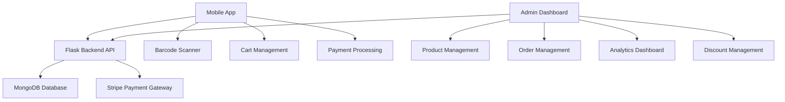

# SmartMart - Smart Shopping Solution

<div align="center">
  
  
  **Be Smart, Shop Smart**
  
  [](https://flutter.dev/)
  [](https://reactjs.org/)
  [](https://flask.palletsprojects.com/)
  [](https://www.mongodb.com/)
  [](https://stripe.com/)
</div>

---

## 📋 Table of Contents

- [Overview](#overview)
- [Project Architecture](#project-architecture)
- [Features](#features)
- [Technology Stack](#technology-stack)
- [Prerequisites](#prerequisites)
- [Installation & Setup](#installation--setup)
- [Running the Application](#running-the-application)
- [API Documentation](#api-documentation)
- [Target Users](#target-users)
- [Future Expansion](#future-expansion)
- [Contributing](#contributing)
- [License](#license)
- [Developed By](#developed-by)

---

## 🎯 Overview

SmartMart is a comprehensive smart shopping solution that revolutionizes the retail experience through barcode scanning, automated cart management, and seamless payment processing. The platform consists of three integrated components: a Flutter mobile application for customers, a React-based admin dashboard for store management, and a Flask backend API for data processing and business logic.

### Key Highlights
- **Barcode Scanning**: Quick product identification and addition to cart
- **Real-time Cart Management**: Synchronized cart across devices
- **Secure Payment Processing**: Integrated Stripe payment gateway
- **Admin Dashboard**: Comprehensive analytics and inventory management
- **Discount Management**: Dynamic pricing and promotional offers
- **Order Tracking**: Complete order lifecycle management

---

## 🏗️ Project Architecture

```
SmartMart/
├── 📱 smartmart_mobile/          # Flutter Mobile Application
│   ├── lib/
│   │   ├── models/              # Data models (Product, Cart, Order, etc.)
│   │   ├── screens/             # UI screens (Home, Cart, Profile, etc.)
│   │   ├── services/            # API services and business logic
│   │   ├── providers/           # State management (Cart, Auth)
│   │   ├── widgets/             # Reusable UI components
│   │   └── utils/               # Utilities and constants
│   ├── android/                 # Android-specific configurations
│   ├── ios/                     # iOS-specific configurations
│   └── web/                     # Web platform assets
│
├── 🖥️ admin/                     # React Admin Dashboard
│   ├── src/
│   │   ├── components/          # Reusable React components
│   │   ├── pages/               # Dashboard pages (Products, Orders, etc.)
│   │   └── utils/               # Utility functions
│   └── public/                  # Static assets
│
├── ⚙️ backend/                   # Flask Backend API
│   ├── admin.py                 # Admin-specific API endpoints
│   ├── users.py                 # User and payment API endpoints
│   ├── db.py                    # Database connection utilities
│   ├── app.py                   # Flask application entry point
│   └── requirements.txt         # Python dependencies
│
└── 📚 Documentation/
    └── SMARTMART_TEST_SUITES.md # Comprehensive test documentation
```

### System Architecture Flow



---

## ✨ Features

### 📱 Mobile Application Features

#### **Authentication & User Management**
- User registration and login
- Secure session management
- Password change functionality
- User profile management

#### **Shopping Experience**
- **Barcode Scanning**: Quick product identification using device camera
- **Smart Cart**: Real-time cart synchronization across sessions
- **Product Search**: Find products by name or barcode
- **Discount Integration**: Automatic discount application
- **Order History**: Complete purchase history tracking

#### **Payment & Checkout**
- **Stripe Integration**: Secure card and UPI payments
- **Multiple Payment Methods**: Card and UPI support
- **Order Confirmation**: Real-time order status updates
- **Receipt Generation**: Digital receipt management

### 🖥️ Admin Dashboard Features

#### **Dashboard & Analytics**
- **Real-time Metrics**: Sales, orders, inventory, and customer analytics
- **Visual Charts**: Weekly sales trends and revenue analysis
- **Performance Indicators**: Success rates and transaction monitoring

#### **Product Management**
- **CRUD Operations**: Add, edit, delete, and view products
- **Barcode Management**: Product identification system
- **Inventory Tracking**: Stock level monitoring
- **Bulk Operations**: Mass product updates

#### **Order Management**
- **Order Processing**: View and manage customer orders
- **Status Updates**: Track order lifecycle
- **Customer Information**: Order details and customer data
- **Filtering & Search**: Advanced order filtering capabilities

#### **Discount Management**
- **Dynamic Pricing**: Create and manage discount campaigns
- **Date-based Offers**: Time-limited promotional pricing
- **Product-specific Discounts**: Targeted discount application
- **Status Management**: Enable/disable discount offers

#### **Payment Analytics**
- **Transaction Monitoring**: Real-time payment tracking
- **Revenue Analysis**: Monthly and weekly revenue trends
- **Payment Method Analytics**: Card vs UPI usage statistics
- **Success Rate Tracking**: Payment success/failure monitoring

---

## 🛠️ Technology Stack

### Frontend Technologies
- **Flutter**: Cross-platform mobile application development
- **React**: Modern web application framework
- **TypeScript**: Type-safe JavaScript development
- **Tailwind CSS**: Utility-first CSS framework
- **Recharts**: Data visualization library

### Backend Technologies
- **Flask**: Lightweight Python web framework
- **MongoDB**: NoSQL database for flexible data storage
- **PyMongo**: MongoDB driver for Python
- **Werkzeug**: Password hashing and security utilities

### Payment & External Services
- **Stripe**: Payment processing and gateway integration
- **URL Launcher**: External payment page integration
- **WebView**: In-app payment processing

### Development Tools
- **Vite**: Fast build tool for React development
- **ESLint**: Code linting and quality assurance
- **Flutter Launcher Icons**: App icon generation
- **Flutter Native Splash**: Splash screen management

---

## 📋 Prerequisites

### System Requirements
- **Node.js**: Version 18.0 or higher
- **Python**: Version 3.8 or higher
- **Flutter**: Version 3.8.1 or higher
- **MongoDB**: Version 5.0 or higher
- **Git**: Version control system

### Development Environment
- **IDE**: VS Code, Android Studio, or Xcode
- **Package Managers**: npm/yarn, pip, pub
- **Version Control**: Git

### External Services
- **Stripe Account**: For payment processing
- **MongoDB Atlas**: Cloud database (optional)
- **ngrok**: For local development tunneling (optional)

---

## 🚀 Installation & Setup

### 1. Clone the Repository

```bash
git clone https://github.com/yourusername/SmartMart.git
cd SmartMart
```

### 2. Backend Setup

```bash
# Navigate to backend directory
cd backend

# Create virtual environment
python -m venv venv

# Activate virtual environment
# Windows
venv\Scripts\activate
# macOS/Linux
source venv/bin/activate

# Install dependencies
pip install -r requirements.txt

# Set up environment variables
cp .env.example .env
# Edit .env with your configuration
```

### 3. Admin Dashboard Setup

```bash
# Navigate to admin directory
cd ../admin

# Install dependencies
npm install

# Set up environment variables
cp .env.example .env
# Edit .env with your configuration
```

### 4. Mobile Application Setup

```bash
# Navigate to mobile app directory
cd ../smartmart_mobile

# Install Flutter dependencies
flutter pub get

# Generate app icons and splash screens
flutter pub run flutter_launcher_icons:main
flutter pub run flutter_native_splash:create
```

---

## 🏃‍♂️ Running the Application

### Start Backend Server

```bash
cd backend
python app.py
```
**Backend runs on**: `http://localhost:5000`

### Start Admin Dashboard

```bash
cd admin
npm run dev
```
**Admin Dashboard runs on**: `http://localhost:5173`

### Run Mobile Application

```bash
cd smartmart_mobile

# For Android
flutter run

# For iOS
flutter run -d ios

# For Web
flutter run -d web
```

### Development Mode (All Services)

```bash
# Terminal 1 - Backend
cd backend && python app.py

# Terminal 2 - Admin Dashboard
cd admin && npm run dev

# Terminal 3 - Mobile App
cd smartmart_mobile && flutter run
```

---

## 📚 API Documentation

### Authentication Endpoints
- `POST /users/signup` - User registration
- `POST /users/login` - User authentication
- `POST /users/change_password` - Password change

### Product Management
- `GET /admin/product/get_products` - Fetch all products
- `POST /admin/product/add_product` - Add new product
- `PUT /admin/product/update_product` - Update product
- `DELETE /admin/product/delete_product` - Delete product

### Cart Management
- `POST /users/carts/get_products` - Get cart items
- `POST /users/carts/add_product` - Add to cart
- `POST /users/carts/delete_product` - Remove from cart

### Order Management
- `POST /users/orders/place_order` - Place new order
- `POST /users/orders/get_orders` - Get user orders
- `POST /users/orders/get_order_details` - Get order details

### Payment Processing
- `POST /users/create-payment-session` - Create Stripe session
- `POST /users/payment-status` - Check payment status

### Admin Analytics
- `GET /admin/dashboard/weekly_sales` - Weekly sales data
- `GET /admin/dashboard/user_count` - User statistics
- `GET /admin/payments/summary` - Payment analytics

---

## 👥 Target Users

### Primary Users

#### **Retail Customers**
- **Tech-savvy shoppers** seeking convenience
- **Mobile-first users** preferring app-based shopping
- **Price-conscious consumers** looking for discounts
- **Busy professionals** needing quick checkout

#### **Store Administrators**
- **Retail managers** overseeing daily operations
- **Inventory specialists** managing product catalogs
- **Business analysts** tracking sales performance
- **Customer service representatives** handling orders

### Secondary Users

#### **Business Owners**
- **Small to medium retailers** seeking digital transformation
- **Franchise operators** managing multiple locations
- **E-commerce businesses** expanding to physical stores

#### **Developers**
- **Mobile app developers** learning Flutter
- **Backend developers** working with Flask and MongoDB
- **Full-stack developers** building integrated solutions

---

## 🔮 Future Expansion

### Phase 1: Enhanced Features
- **Multi-store Support**: Manage multiple retail locations
- **Advanced Analytics**: AI-powered sales predictions
- **Inventory Alerts**: Low stock notifications
- **Customer Loyalty Program**: Points and rewards system

### Phase 2: Platform Expansion
- **Web Application**: Browser-based shopping experience
- **API Marketplace**: Third-party integrations
- **Mobile POS**: Point-of-sale terminal integration
- **QR Code Payments**: Alternative payment methods

### Phase 3: Enterprise Features
- **Multi-tenant Architecture**: SaaS platform support
- **Advanced Reporting**: Custom report generation
- **Integration APIs**: ERP and CRM system connections
- **White-label Solutions**: Customizable branding

### Phase 4: AI & Automation
- **Smart Recommendations**: ML-based product suggestions
- **Automated Reordering**: AI inventory management
- **Predictive Analytics**: Demand forecasting
- **Voice Commands**: Hands-free shopping experience

---

## 🤝 Contributing

We welcome contributions from the community! Please follow these guidelines:

### Getting Started
1. Fork the repository
2. Create a feature branch (`git checkout -b feature/amazing-feature`)
3. Commit your changes (`git commit -m 'Add amazing feature'`)
4. Push to the branch (`git push origin feature/amazing-feature`)
5. Open a Pull Request

### Code Standards
- Follow existing code style and conventions
- Write comprehensive tests for new features
- Update documentation for API changes
- Ensure all tests pass before submitting

### Reporting Issues
- Use the issue tracker for bug reports
- Provide detailed reproduction steps
- Include system information and logs
- Use appropriate labels for categorization

---

## 📄 License

This project is licensed under the MIT License - see the [LICENSE](LICENSE) file for details.

---

## 👨‍💻 Developed By

### Development Team

**Lead Developer**: [Your Name]
- **Email**: your.email@example.com
- **LinkedIn**: [Your LinkedIn Profile]
- **GitHub**: [Your GitHub Profile]

### Project Contributors

- **Backend Development**: Flask API and MongoDB integration
- **Frontend Development**: React admin dashboard
- **Mobile Development**: Flutter application
- **UI/UX Design**: User interface and experience design
- **DevOps**: Deployment and infrastructure management

### Acknowledgments

- **Stripe**: Payment processing services
- **MongoDB**: Database solutions
- **Flutter Team**: Mobile development framework
- **React Team**: Web development framework
- **Open Source Community**: Various libraries and tools

---

<div align="center">
  <p>Made with ❤️ by the SmartMart Development Team</p>
  <p>© 2024 SmartMart. All rights reserved.</p>
</div>